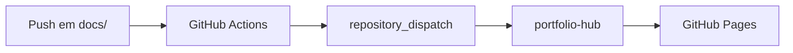

# Como construí um portfolio GitOps com GitHub Pages e Astro

A maioria dos portfolios de desenvolvedor é uma página estática com uma lista de projetos e links para o GitHub. Funciona, mas não mostra muito sobre como você trabalha. Queria algo diferente: um hub que refletisse meu processo real de desenvolvimento — com documentação viva, releases rastreáveis e automação que funciona enquanto você dorme.

## O problema

Tenho vários projetos em repositórios separados. Cada um tem sua própria documentação, seu próprio `CHANGELOG.md`, suas próprias releases. Manter um portfolio atualizado manualmente seria trabalho duplicado — e trabalho duplicado eventualmente vira trabalho abandonado.

## A solução: dois fluxos independentes

O design central do portfolio-hub é a separação entre **documentação** (iterativa) e **changelog** (marcos formais).

```
repo-projeto-a  ──► portfolio-hub ──► GitHub Pages
repo-projeto-b  ──►
repo-projeto-n  ──►
```

Cada projeto tem dois workflows:

- `docs.yml` — disparado quando há push em `docs/`. Notifica o hub para buscar a documentação atualizada.
- `release.yml` — disparado quando uma tag `v*.*.*` é criada. Notifica o hub para atualizar o changelog e a versão.

O hub recebe esses eventos via `repository_dispatch` — o mecanismo nativo do GitHub, sem infraestrutura adicional.

## Por que Astro?

Astro é perfeito para sites estáticos com conteúdo dinâmico em build time. Posso ler arquivos JSON e Markdown diretamente no servidor durante o build, sem precisar de uma API ou banco de dados. O resultado é HTML puro, servido pelo GitHub Pages.

```typescript
// Lendo projetos em build time
const dir = join(process.cwd(), 'projects');
const files = readdirSync(dir).filter(f => f.endsWith('.json'));
const projects = files.map(f => JSON.parse(readFileSync(join(dir, f), 'utf-8')));
```

## Suporte a diagramas Mermaid

Um detalhe que faz diferença: a documentação suporta diagramas Mermaid nativamente. Qualquer bloco de código com linguagem `mermaid` é renderizado como SVG interativo.



Isso significa que posso documentar arquiteturas complexas diretamente no Markdown, sem precisar exportar imagens ou usar ferramentas externas.

## O que aprendi

**Zero infraestrutura é uma feature.** Usar `repository_dispatch` em vez de webhooks externos elimina a necessidade de um endpoint público, filas de mensagem ou qualquer serviço adicional. O histórico de execuções fica visível na aba Actions do GitHub.

**Separar docs de releases foi a decisão certa.** Documentação e releases têm cadências completamente diferentes. Acoplá-las em um único fluxo forçaria uma ao ritmo da outra.

**O portfolio é ele mesmo um exemplo do que documenta.** Cada projeto aqui tem documentação viva, changelog gerado por git tags, e deploy automático. O hub não é exceção.

## Próximos passos

- Adicionar suporte a posts de blog (este post é o primeiro!)
- Webhooks para sincronização em tempo real
- Métricas de atividade por projeto

O código está disponível em [github.com/uMatheusx/portfolio-hub](https://github.com/uMatheusx/portfolio-hub).
