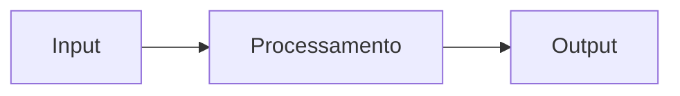

# Setup Guide — Portfolio Hub

Referência para configurar o site, adicionar posts no blog, e integrar novos projetos.

---

## Índice

1. [Adicionando Posts no Blog](#adicionando-posts-no-blog)
2. [Estrutura de Projeto](#estrutura-de-projeto)
3. [Conventional Commits e Changelog](#conventional-commits-e-changelog)
4. [Integração com Portfolio Hub](#integração-com-portfolio-hub)
5. [GitHub Actions](#github-actions)
6. [Templates de Configuração](#templates-de-configuração)

---

## Adicionando Posts no Blog

Posts ficam em `content/blog/` como arquivos Markdown com frontmatter YAML.

### Criando um post

Crie um arquivo em `content/blog/meu-post.md`. O nome do arquivo vira a URL: `/blog/meu-post`.

```markdown
---
title: Título do Post
description: Um parágrafo descrevendo o assunto — aparece na listagem e no SEO.
date: 2026-04-21
tags: [Go, GitOps, Backend]
featured: true
---

Conteúdo do post em Markdown aqui.
```

### Campos do frontmatter

| Campo | Obrigatório | Descrição |
|-------|-------------|-----------|
| `title` | sim | Título exibido na listagem e no post |
| `description` | não | Subtítulo/resumo — aparece na listagem |
| `date` | sim | Data no formato `YYYY-MM-DD` — define a ordenação |
| `tags` | não | Array de tags, ex: `[Go, GitOps]` — ativa o filtro |
| `featured` | não | `true` exibe o post como destaque no topo da listagem |

> Apenas um post deve ter `featured: true`. Se nenhum tiver, o post mais recente é destacado automaticamente.

### Formatação suportada

O conteúdo aceita Markdown padrão:

````markdown
## Título de seção

Parágrafo com **negrito**, _itálico_ e `código inline`.

- Item de lista
- Outro item

```go
func main() {
    fmt.Println("hello")
}
```

> Blockquote para citações ou notas.
````

Para diagramas, use blocos de código com a linguagem `mermaid`:

````markdown

````

### Fluxo de publicação

1. Crie o arquivo em `content/blog/`
2. Faça commit e push para `main`
3. O GitHub Actions faz o deploy automaticamente

```bash
git add content/blog/meu-post.md
git commit -m "docs: add post sobre meu tema"
git push
```

---

## Estrutura de Projeto

```
seu-projeto/
├── .github/
│   └── workflows/
│       ├── ci.yml
│       ├── release.yml
│       └── docs.yml
├── docs/
│   ├── README.md
│   ├── architecture.md
│   └── usage.md
├── src/
├── tests/
├── .commitlintrc.json
├── .gitignore
├── CHANGELOG.md
├── LICENSE
└── README.md
```

### Setup inicial

```bash
mkdir seu-projeto && cd seu-projeto
git init

# Node.js
npm init -y

# Go
go mod init github.com/seu-usuario/seu-projeto

# Rust
cargo init
```

---

## Conventional Commits e Changelog

O portfolio-hub gera o `CHANGELOG.md` automaticamente via GitHub Actions a cada push para `main`. O histórico é segmentado por **git tags** — o CI só toca a seção da versão atual (desde o último tag), então tudo antes do último tag é imutável e pode ser editado livremente.

### Como funciona

```
[v1.0.0] ←── tag "congela" essa seção; CI nunca a reescreve
  fix: corrige layout mobile
  feat: adiciona blog

[v1.1.0] ←── nova tag criada quando você quiser "fechar" a versão
  feat: adiciona filtro de tags   ← CI escreve aqui automaticamente
  fix: clipping de descender      ←
                                  ← você pode editar à vontade antes de taggear
```

**Fluxo do dia a dia:**

1. Você faz commits no padrão `tipo: descrição` e dá push para `main`
2. O CI adiciona automaticamente a entrada no CHANGELOG desde o último tag
3. Você pode editar o CHANGELOG manualmente a qualquer momento (veja abaixo)
4. Quando quiser "fechar" uma versão, cria um tag — isso congela aquela seção

### Tipos de commit reconhecidos

| Tipo | Seção no changelog | Quando usar |
|------|-------------------|-------------|
| `feat` | Features | Nova funcionalidade |
| `fix` | Bug Fixes | Correção de bug |
| `perf` | Performance | Melhoria de performance |
| `docs` | — (omitido) | Só documentação |
| `refactor` | — (omitido) | Refatoração sem mudança funcional |
| `test` | — (omitido) | Testes |
| `chore` | — (omitido) | Build, dependências, CI |

### Exemplos de commits

```bash
git commit -m "feat: adiciona página de blog com filtro por tag"
git commit -m "fix: corrige clipping de descender em títulos prose"
git commit -m "feat(blog): exibe post em destaque no topo da listagem"
git commit -m "fix(nav): logo não renderizava no Firefox"
```

O escopo entre parênteses é opcional:

```bash
git commit -m "feat(blog): ..."    # afeta o blog
git commit -m "fix(docs): ..."     # afeta docs
git commit -m "chore(ci): ..."     # afeta workflows
```

### Editando o CHANGELOG manualmente

Para editar entradas geradas (melhorar descrições, corrigir texto, remover ruído):

```bash
# Edite o arquivo
code CHANGELOG.md

# Commit SÓ com CHANGELOG.md — o CI não roda (paths-ignore)
git add CHANGELOG.md
git commit -m "docs: ajusta changelog"
git push
```

> **Importante:** o CI só não sobrescreve se o commit contiver apenas `CHANGELOG.md` (ou `docs/`, `content/`). Se você editar o changelog junto com código, o CI vai rodar e regenerar a seção atual. Edite sempre em commit separado.

### Fechando uma versão (criando um tag)

Criar um tag "congela" a seção atual no CHANGELOG — o CI começa uma nova seção acima para a próxima versão.

```bash
# Bumpa a versão no package.json (sem criar tag ainda)
npm run version:patch   # 1.0.0 → 1.0.1
npm run version:minor   # 1.0.0 → 1.1.0
npm run version:major   # 1.0.0 → 2.0.0

# Gera o changelog completo, commita e cria o tag
npm run release

# Envia o tag para o GitHub
git push && git push --tags
```

Após o push do tag, o GitHub Actions inicia o deploy. A seção anterior fica permanentemente preservada.

### Gerando o changelog localmente

```bash
# Desde o último tag (igual ao CI)
npm run changelog

# Regenera o arquivo inteiro do zero
npm run changelog:all
```

### Configuração (já feita)

**`package.json`:**

```json
{
  "scripts": {
    "changelog":      "conventional-changelog -p angular -i CHANGELOG.md -s -r 1",
    "changelog:all":  "conventional-changelog -p angular -i CHANGELOG.md -s -r 0",
    "release":        "npm run changelog:all && git add CHANGELOG.md && git commit -m 'docs: update changelog' && git tag v$(node -p \"require('./package.json').version\")",
    "version:patch":  "npm version patch --no-git-tag-version",
    "version:minor":  "npm version minor --no-git-tag-version",
    "version:major":  "npm version major --no-git-tag-version"
  }
}
```

**`.github/workflows/changelog.yml`** — roda em push para `main`, exceto quando só `CHANGELOG.md`, `docs/` ou `content/` mudam (evita loops):

```yaml
on:
  push:
    branches: [main]
    paths-ignore:
      - CHANGELOG.md
      - 'docs/**'
      - 'content/**'
```

O commit gerado pelo bot usa `[skip ci]` para não disparar um novo deploy.

---

### Setup em projetos externos (integrados ao portfolio-hub)

Para projetos que enviam changelog ao portfolio-hub via `repository_dispatch`:

#### 1. Instale as dependências

```bash
npm install --save-dev \
  @commitlint/cli \
  @commitlint/config-conventional \
  commitizen \
  cz-conventional-changelog \
  conventional-changelog-cli \
  husky
```

#### 2. Configure Commitizen e Husky

```bash
npx commitizen init cz-conventional-changelog --save-dev --save-exact
npx husky install
npx husky add .husky/commit-msg 'npx --no -- commitlint --edit "$1"'
```

#### 3. Scripts em `package.json`

```json
{
  "scripts": {
    "commit": "cz",
    "changelog": "conventional-changelog -p angular -i CHANGELOG.md -s",
    "release": "npm run changelog && git add CHANGELOG.md && git commit -m 'docs: update changelog' && npm version patch",
    "release:minor": "npm run changelog && git add CHANGELOG.md && git commit -m 'docs: update changelog' && npm version minor",
    "release:major": "npm run changelog && git add CHANGELOG.md && git commit -m 'docs: update changelog' && npm version major"
  }
}
```

#### 4. `.commitlintrc.json`

```json
{
  "extends": ["@commitlint/config-conventional"],
  "rules": {
    "type-enum": [2, "always", ["feat", "fix", "docs", "style", "refactor", "perf", "test", "chore", "revert"]],
    "subject-case": [2, "never", ["start-case", "pascal-case", "upper-case"]]
  }
}
```

#### Fluxo de release

```bash
npm run commit           # commit interativo
npm run release          # patch: 1.0.0 → 1.0.1
npm run release:minor    # minor: 1.0.0 → 1.1.0
npm run release:major    # major: 1.0.0 → 2.0.0
```

---

## Integração com Portfolio Hub

### 1. Arquivo de metadados

Crie `projects/seu-projeto.json` no portfolio-hub:

```json
{
  "name": "seu-projeto",
  "display_name": "Seu Projeto",
  "description": "Descrição breve e impactante",
  "version": "1.0.0",
  "tags": ["Go", "Kubernetes", "Docker"],
  "repo_url": "https://github.com/seu-usuario/seu-projeto",
  "status": "active",
  "docs_updated_at": "2024-01-15T10:00:00Z",
  "changelog_updated_at": "2024-01-15T10:00:00Z"
}
```

**Status válidos:** `active` | `wip` | `archived`

### 2. Documentação no Portfolio Hub

```
docs/seu-projeto/
├── README.md
├── architecture.md
└── usage.md
```

### 3. Pull Request

```bash
cd portfolio-hub
git checkout -b add/seu-projeto
# adicione projects/seu-projeto.json e docs/seu-projeto/
git add .
npm run commit
git push origin add/seu-projeto
```

---

## GitHub Actions

### CI — `.github/workflows/ci.yml`

```yaml
name: CI
on:
  push:
    branches: [main]
  pull_request:
    branches: [main]

jobs:
  test:
    runs-on: ubuntu-latest
    steps:
      - uses: actions/checkout@v4
      - uses: actions/setup-node@v4
        with:
          node-version: '20'
          cache: 'npm'
      - run: npm ci
      - run: npm run lint
      - run: npm test
      - run: npm run build
```

### Release — `.github/workflows/release.yml`

```yaml
name: Release
on:
  push:
    tags: ['v*']

jobs:
  release:
    runs-on: ubuntu-latest
    steps:
      - uses: actions/checkout@v4
      - uses: actions/setup-node@v4
        with:
          node-version: '20'
          cache: 'npm'
      - run: npm ci
      - run: npm run changelog
      - uses: softprops/action-gh-release@v1
        with:
          body_path: CHANGELOG.md
        env:
          GITHUB_TOKEN: ${{ secrets.GITHUB_TOKEN }}
```

---

## Templates de Configuração

### `.gitignore`

```
node_modules/
dist/
build/
.env
.env.local
.DS_Store
*.log
coverage/
```

### `.editorconfig`

```
root = true

[*]
charset = utf-8
end_of_line = lf
insert_final_newline = true
trim_trailing_whitespace = true

[*.{js,ts,jsx,tsx}]
indent_style = space
indent_size = 2

[*.{md,markdown}]
trim_trailing_whitespace = false
```

### `.prettierrc.json`

```json
{
  "semi": true,
  "trailingComma": "es5",
  "singleQuote": true,
  "printWidth": 100,
  "tabWidth": 2
}
```

---

## Checklist

- [ ] Repositório criado com estrutura correta
- [ ] `docs/` com no mínimo `README.md`
- [ ] Commitizen e Husky configurados
- [ ] GitHub Actions de CI e Release
- [ ] LICENSE e README.md
- [ ] Primeiro release criado (`v0.1.0`)
- [ ] `projects/seu-projeto.json` adicionado no portfolio-hub
- [ ] PR aberta no portfolio-hub

---

**Referências:** [Conventional Commits](https://www.conventionalcommits.org/) · [Semantic Versioning](https://semver.org/) · [Keep a Changelog](https://keepachangelog.com/)
