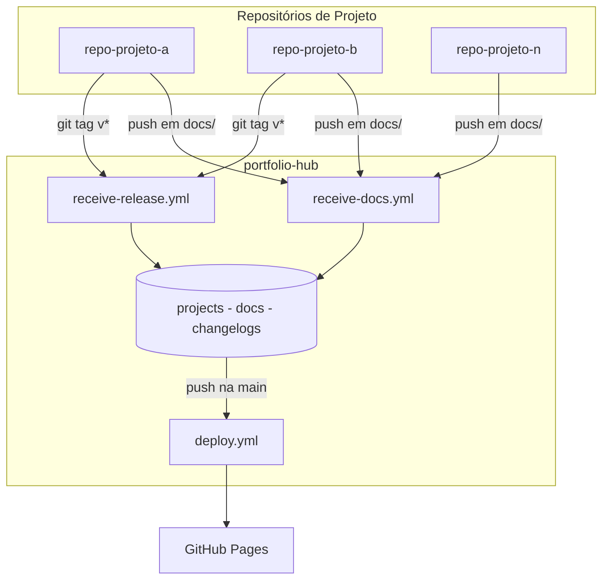
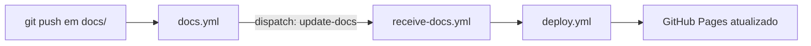
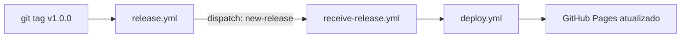
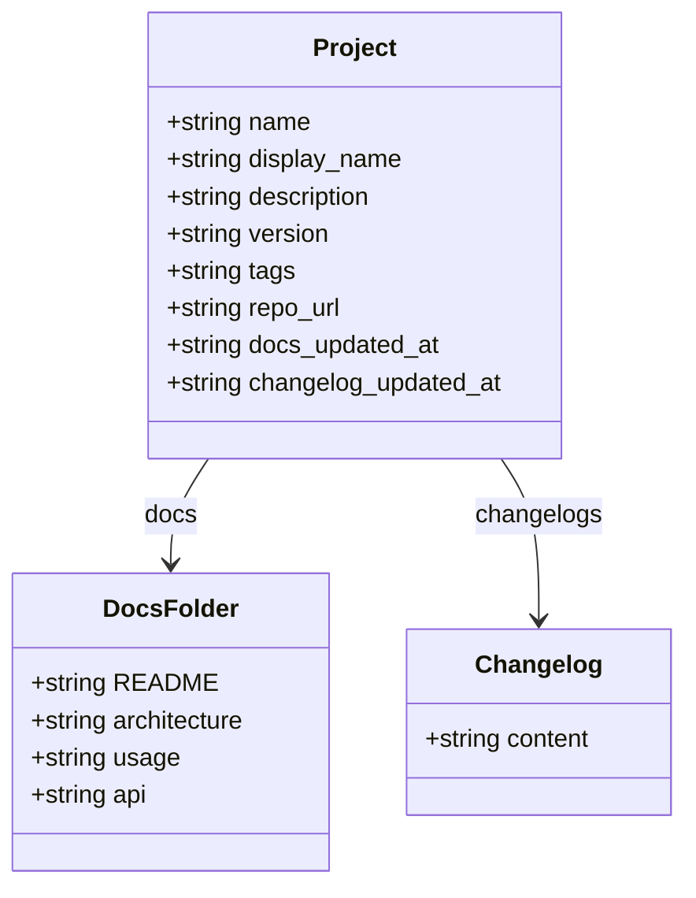
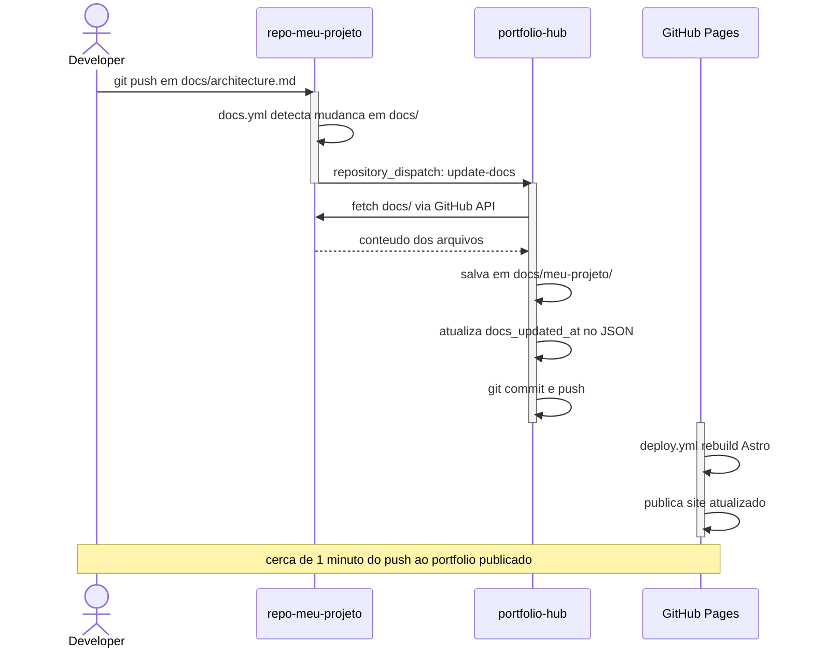

# Arquitetura

## Visão Geral

O portfolio-hub é um **agregador de documentação e changelogs**. Cada projeto mantém suas próprias docs — o hub centraliza tudo e publica um site estático no GitHub Pages.

## Dois Fluxos Independentes

**Fluxo 1 — Documentação** (~1 min):

**Fluxo 2 — Changelog** (~1 min):

## O que o Hub Armazena por Projeto

## Sequência Completa de uma Atualização de Docs

## Decisões de Design

### O hub não faz deploy de projetos

Cada projeto tem seu ciclo de vida próprio. O `release.yml` no projeto notifica o hub, mas o deploy do projeto para qualquer infraestrutura (Lambda, ECS, Kubernetes, VPS) é responsabilidade exclusiva do repo do projeto.

### Por que dois eventos separados?

| | `update-docs` | `new-release` |
|---|---|---|
| **Cadência** | Contínua, iterativa | Formal, versionada |
| **Gatilho** | Push em `docs/` | `git tag` |
| **O que atualiza** | `docs/projeto/` | `changelogs/projeto.md` + versão no JSON |
| **Cria versão nova?** | Não | Sim |

Separar os dois evita que uma melhoria de documentação precise criar uma release, e que uma release precise ter documentação perfeita.
