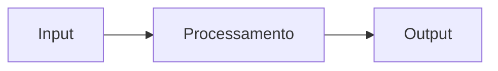

# Arquitetura

> Substitua este arquivo com as decisões de design e arquitetura do seu projeto.

## Visão geral

Descreva a estrutura de alto nível do sistema.

## Componentes

### Componente A

Descreva o papel e responsabilidade de cada componente principal.

### Componente B

...

## Decisões de design

Registre aqui o raciocínio por trás das escolhas técnicas relevantes — tecnologias escolhidas, padrões adotados, trade-offs conscientes.

| Decisão | Alternativa considerada | Motivo da escolha |
|---------|------------------------|-------------------|
| | | |

## Dependências externas

Liste serviços externos, APIs ou infraestrutura da qual o projeto depende.
