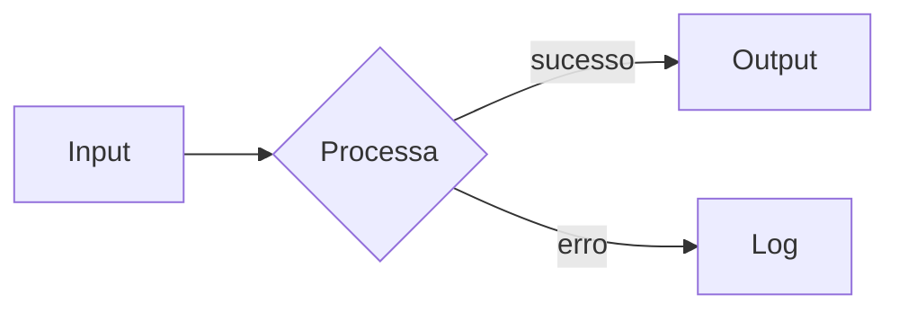
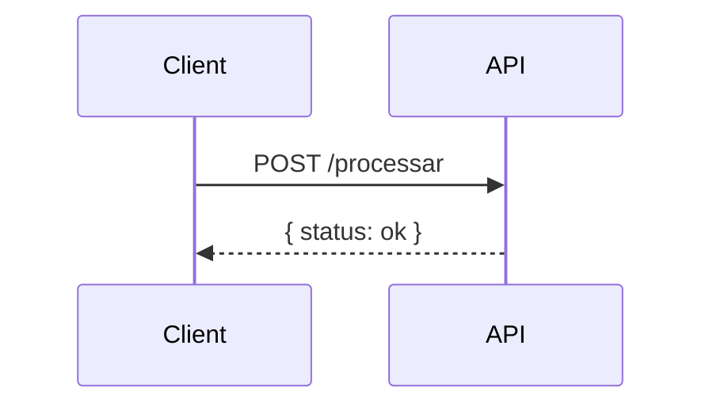
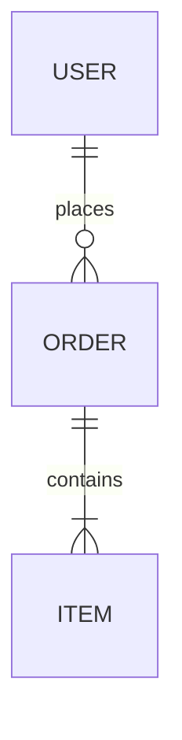

# GitOps Portfolio Hub — Especificação

**Versão:** 2.0.0
**Stack:** GitHub Pages · GitHub Actions · Astro

---

## Sumário

1. [Visão Geral](#1-visão-geral)
2. [Dois Fluxos Independentes](#2-dois-fluxos-independentes)
3. [Estrutura de Repositórios](#3-estrutura-de-repositórios)
4. [Formato do JSON de Projeto](#4-formato-do-json-de-projeto)
5. [Workflows nos Projetos](#5-workflows-nos-projetos)
6. [Workflows no portfolio-hub](#6-workflows-no-portfolio-hub)
7. [Adicionando um Novo Projeto](#7-adicionando-um-novo-projeto)
8. [Diagramas e Ilustrações](#8-diagramas-e-ilustrações)
9. [GitHub Pages](#9-github-pages)
10. [Decisões de Design](#10-decisões-de-design)

---

## 1. Visão Geral

O **portfolio-hub** é um agregador GitOps de documentação e changelogs. Cada projeto mantém sua própria documentação e histórico de releases — o hub apenas centraliza essas informações e publica um site estático no GitHub Pages.

**O portfolio não sabe como cada projeto roda.** Um projeto pode ser uma Lambda, um container no ECS, uma API em Kubernetes, uma biblioteca ou um CLI. Isso é irrelevante para o hub. O que importa é o contrato: `docs/` e `CHANGELOG.md`.

```
repo-projeto-a  ──► portfolio-hub ──► GitHub Pages
repo-projeto-b  ──►
repo-projeto-n  ──►
```

### O que o portfolio exibe

- **Documentação** de cada projeto (renderizada com suporte a diagramas Mermaid)
- **Changelog** versionado de cada projeto
- **Metadados**: versão atual, tags, link para o repositório

### O que o portfolio NÃO faz

- Não deploya código de nenhum projeto
- Não tem opinião sobre como os projetos rodam
- Não exige AWS, Lambda, ou qualquer infraestrutura externa

---

## 2. Dois Fluxos Independentes

O design central é a separação entre documentação (iterativa) e changelog (marcos formais).

| Fluxo | Gatilho | O que atualiza | Tempo |
|---|---|---|---|
| **Documentação** | Push em `docs/` no repo do projeto | `docs/projeto/` no hub | ~1 min |
| **Changelog** | `git tag vX.Y.Z` no repo do projeto | `changelogs/projeto.md` + `projects/projeto.json` | ~1 min |

A separação é intencional: você pode melhorar a documentação sem criar uma release, e pode fazer uma release sem reescrever a documentação.

### Fluxo 1 — Documentação

```
git push (alteração em docs/)
        │
        ▼
GitHub Actions: docs.yml
        │
        ▼ repository_dispatch: update-docs
        │
portfolio-hub: receive-docs.yml
        │  1. Faz fetch de cada arquivo em docs/ via API do GitHub
        │  2. Salva em docs/projeto/ no hub
        │  3. Atualiza docs_updated_at no projects/projeto.json
        │  4. git commit + push
        ▼
GitHub Actions: deploy.yml
        │
        ▼
GitHub Pages atualizado ✓
```

### Fluxo 2 — Changelog

```
git tag v2.0.0 && git push --tags
        │
        ▼
GitHub Actions: release.yml
        │
        ▼ repository_dispatch: new-release
        │
portfolio-hub: receive-release.yml
        │  1. Atualiza projects/projeto.json (versão, data)
        │  2. Faz fetch do CHANGELOG.md e salva em changelogs/projeto.md
        │  3. git commit + push
        ▼
GitHub Actions: deploy.yml
        │
        ▼
GitHub Pages atualizado ✓
```

---

## 3. Estrutura de Repositórios

### Repositório de cada projeto

```
repo-meu-projeto/
├── .github/
│   └── workflows/
│       ├── docs.yml        ← fluxo 1: push em docs/ → notifica hub
│       └── release.yml     ← fluxo 2: git tag → notifica hub
├── docs/
│   ├── README.md           ← visão geral (obrigatório)
│   ├── architecture.md     ← decisões técnicas, diagramas Mermaid
│   ├── usage.md            ← como usar, exemplos
│   └── api.md              ← contrato da API (opcional)
└── CHANGELOG.md            ← atualizado a cada release
```

O projeto pode ter qualquer outra estrutura além dessas pastas. O hub só lê `docs/` e `CHANGELOG.md`.

### portfolio-hub

```
portfolio-hub/
├── .github/
│   └── workflows/
│       ├── receive-docs.yml    ← escuta: update-docs
│       ├── receive-release.yml ← escuta: new-release
│       └── deploy.yml          ← push na main → publica GitHub Pages
├── projects/
│   └── meu-projeto.json        ← metadados de cada projeto
├── docs/
│   └── meu-projeto/            ← cópia da documentação (gerada pelo hub)
│       ├── README.md
│       ├── architecture.md
│       └── usage.md
├── changelogs/
│   └── meu-projeto.md          ← cópia do changelog (gerada pelo hub)
├── src/                        ← site Astro
│   ├── pages/
│   │   ├── index.astro         ← homepage com grid de projetos
│   │   └── projects/
│   │       └── [slug].astro    ← página por projeto (docs + changelog)
│   ├── components/
│   │   └── ProjectCard.astro
│   ├── layouts/
│   │   └── Layout.astro
│   └── config.ts               ← nome do site, usuário GitHub
├── astro.config.mjs
├── package.json
└── tailwind.config.mjs
```

---

## 4. Formato do JSON de Projeto

Cada projeto tem um arquivo em `projects/nome-do-projeto.json`:

```json
{
  "name": "meu-projeto",
  "display_name": "Meu Projeto",
  "description": "Breve descrição do que o projeto faz.",
  "version": "1.0.0",
  "tags": ["api", "python", "backend"],
  "repo_url": "https://github.com/usuario/meu-projeto",
  "docs_updated_at": "2026-04-21T10:00:00Z",
  "changelog_updated_at": "2026-04-21T14:00:00Z"
}
```

| Campo | Quem atualiza | Obrigatório |
|---|---|---|
| `name` | Manual (criação) | Sim |
| `display_name` | Manual ou via `new-release` | Sim |
| `description` | Manual ou via `new-release` | Recomendado |
| `version` | `receive-release.yml` | Não (atualizado automaticamente) |
| `tags` | Manual | Não |
| `repo_url` | Manual ou via `new-release` | Recomendado |
| `docs_updated_at` | `receive-docs.yml` | Automático |
| `changelog_updated_at` | `receive-release.yml` | Automático |

Os campos `docs_updated_at` e `changelog_updated_at` são atualizados por fluxos separados. Isso permite exibir no portfolio quando cada seção foi atualizada pela última vez de forma independente.

---

## 5. Workflows nos Projetos

Esses dois arquivos devem existir em **cada repositório** que você quiser que apareça no portfolio.

### `docs.yml` — fluxo de documentação

```yaml
name: Update Docs

on:
  push:
    branches: [main]
    paths:
      - 'docs/**'

jobs:
  notify-hub:
    runs-on: ubuntu-latest
    steps:
      - uses: actions/checkout@v4

      - name: Dispatch docs update to portfolio-hub
        uses: peter-evans/repository-dispatch@v3
        with:
          token: ${{ secrets.PORTFOLIO_TOKEN }}
          repository: seu-usuario/portfolio-hub
          event-type: update-docs
          client-payload: |
            {
              "project": "${{ github.event.repository.name }}",
              "repo_url": "https://github.com/${{ github.repository }}",
              "commit_sha": "${{ github.sha }}",
              "updated_at": "${{ github.event.head_commit.timestamp }}"
            }
```

### `release.yml` — fluxo de changelog

```yaml
name: Release

on:
  push:
    tags: ['v*.*.*']

jobs:
  notify-hub:
    runs-on: ubuntu-latest
    steps:
      - uses: actions/checkout@v4

      - name: Dispatch release to portfolio-hub
        uses: peter-evans/repository-dispatch@v3
        with:
          token: ${{ secrets.PORTFOLIO_TOKEN }}
          repository: seu-usuario/portfolio-hub
          event-type: new-release
          client-payload: |
            {
              "project": "${{ github.event.repository.name }}",
              "display_name": "${{ github.event.repository.description }}",
              "version": "${{ github.ref_name }}",
              "repo_url": "https://github.com/${{ github.repository }}",
              "updated_at": "${{ github.event.head_commit.timestamp }}"
            }
```

> **Nota:** o `release.yml` só notifica o hub. O deploy do projeto (para Lambda, ECS, Kubernetes, etc.) é responsabilidade do próprio projeto e pode ser feito no mesmo workflow ou em um separado.

### GitHub Secrets necessários em cada projeto

| Secret | Onde criar | Valor |
|---|---|---|
| `PORTFOLIO_TOKEN` | Cada repo de projeto | Personal Access Token (PAT) com permissão `Contents: Read and Write` no `portfolio-hub` |

Para criar o PAT: **GitHub → Settings → Developer settings → Personal access tokens → Fine-grained tokens**
- Resource owner: sua conta
- Repository access: only `portfolio-hub`
- Permissions: `Contents: Read and Write`

---

## 6. Workflows no portfolio-hub

### `receive-docs.yml`

Disparado pelo evento `update-docs`. Faz fetch dos arquivos de `docs/` do repositório de origem e salva localmente.

```yaml
name: Receive Docs Update

on:
  repository_dispatch:
    types: [update-docs]

jobs:
  update-docs:
    runs-on: ubuntu-latest
    steps:
      - uses: actions/checkout@v4

      - name: Fetch docs from project repo
        run: |
          PROJECT="${{ github.event.client_payload.project }}"
          OWNER_REPO="${{ github.event.client_payload.repo_url }}"
          OWNER_REPO="${OWNER_REPO#https://github.com/}"
          SHA="${{ github.event.client_payload.commit_sha }}"

          mkdir -p docs/${PROJECT}

          FILES=$(curl -sf \
            -H "Authorization: token ${{ secrets.PORTFOLIO_TOKEN }}" \
            "https://api.github.com/repos/${OWNER_REPO}/contents/docs?ref=${SHA}" \
            | jq -r '.[].name')

          for FILE in $FILES; do
            curl -sf \
              -H "Authorization: token ${{ secrets.PORTFOLIO_TOKEN }}" \
              "https://raw.githubusercontent.com/${OWNER_REPO}/${SHA}/docs/${FILE}" \
              > "docs/${PROJECT}/${FILE}"
          done

      - name: Update docs_updated_at in project JSON
        run: |
          PROJECT="${{ github.event.client_payload.project }}"
          TIMESTAMP="${{ github.event.client_payload.updated_at }}"
          JSON_FILE="projects/${PROJECT}.json"

          if [ -f "$JSON_FILE" ]; then
            jq --arg ts "$TIMESTAMP" '.docs_updated_at = $ts' "$JSON_FILE" > /tmp/updated.json
            mv /tmp/updated.json "$JSON_FILE"
          fi

      - name: Commit and push
        run: |
          git config user.name "portfolio-bot[bot]"
          git config user.email "portfolio-bot@users.noreply.github.com"
          git add docs/ projects/
          git diff --staged --quiet || git commit -m "docs(${{ github.event.client_payload.project }}): update documentation"
          git push
```

### `receive-release.yml`

Disparado pelo evento `new-release`. Atualiza o JSON do projeto e copia o `CHANGELOG.md`.

O workflow faz fetch do `CHANGELOG.md` diretamente do repositório de origem. Se não encontrar, usa o corpo da última GitHub Release como fallback.

### `deploy.yml`

Disparado por qualquer push na branch `main`. Reconstrói o site Astro e publica no GitHub Pages via `actions/deploy-pages`.

---

## 7. Adicionando um Novo Projeto

### Passo 1 — Criar o JSON no hub (entrada manual)

Crie `projects/nome-do-projeto.json` e faça push no `portfolio-hub`. O projeto já aparece na homepage.

```json
{
  "name": "nome-do-projeto",
  "display_name": "Nome Legível",
  "description": "O que esse projeto faz.",
  "version": "0.1.0",
  "tags": ["backend", "python"],
  "repo_url": "https://github.com/seu-usuario/nome-do-projeto",
  "docs_updated_at": "",
  "changelog_updated_at": ""
}
```

### Passo 2 — Adicionar workflows no repo do projeto

Crie `.github/workflows/docs.yml` e `.github/workflows/release.yml` conforme a seção 5.

Adicione o secret `PORTFOLIO_TOKEN` no repo do projeto.

### Passo 3 — Criar documentação

```
docs/
├── README.md       ← obrigatório: visão geral do projeto
├── architecture.md ← opcional: diagramas, decisões técnicas
└── usage.md        ← opcional: como usar, exemplos
```

Push em qualquer arquivo dentro de `docs/` → documentação atualizada no portfolio em ~1 minuto.

### Passo 4 — Criar a primeira release

```bash
# Atualizar o CHANGELOG.md com as mudanças da versão
git add CHANGELOG.md
git commit -m "chore: release v1.0.0"
git tag v1.0.0
git push && git push --tags
```

O `release.yml` dispara, notifica o hub, e o changelog aparece no portfolio em ~1 minuto.

---

## 8. Diagramas e Ilustrações

A documentação suporta **diagramas Mermaid** nativamente. Qualquer bloco de código com linguagem `mermaid` é renderizado como SVG interativo no portfolio.

### Tipos suportados

**Fluxograma:**
~~~markdown

~~~

**Diagrama de sequência:**
~~~markdown

~~~

**Diagrama de entidade:**
~~~markdown

~~~

**Outros tipos:** `classDiagram`, `gantt`, `pie`, `gitGraph`, `C4Context`.

### Ilustrações e imagens

Coloque imagens em `docs/` junto com os arquivos Markdown e referencie normalmente:

```markdown

```

O workflow `receive-docs.yml` faz fetch de **todos os arquivos** em `docs/`, incluindo imagens.

### Formato recomendado para CHANGELOG.md

Siga o padrão [Keep a Changelog](https://keepachangelog.com):

```markdown
# Changelog

## [2.0.0] - 2026-04-21

### Adicionado
- Endpoint /processar com suporte a streaming

### Alterado
- Timeout aumentado de 30s para 60s

### Corrigido
- Bug de encoding UTF-8 em inputs especiais

## [1.0.0] - 2026-03-10

### Adicionado
- Versão inicial
```

### Automatizando o CHANGELOG com Conventional Commits

Use o `release-please` para gerar CHANGELOGs automaticamente a partir das mensagens de commit:

```yaml
# .github/workflows/release-please.yml
name: Release Please
on:
  push:
    branches: [main]
jobs:
  release-please:
    runs-on: ubuntu-latest
    steps:
      - uses: google-github-actions/release-please-action@v4
        with:
          release-type: simple
```

Com isso, use mensagens de commit no padrão Conventional Commits:
- `feat: nova funcionalidade` → incrementa versão minor
- `fix: correção de bug` → incrementa versão patch
- `feat!: breaking change` → incrementa versão major

O `release-please` cria automaticamente uma PR com o CHANGELOG atualizado e a tag de versão.

---

## 9. GitHub Pages

### Configuração inicial

1. No `portfolio-hub`, edite `src/config.ts`:
   ```ts
   export const SITE_CONFIG = {
     githubUser: 'seu-usuario',
     siteName: 'Portfolio',
     siteDescription: 'Descrição do portfolio',
   };
   ```

2. Edite `astro.config.mjs`:
   ```js
   export default defineConfig({
     site: 'https://seu-usuario.github.io',
     base: '/portfolio-hub',
   });
   ```

3. No GitHub, ative o Pages: **Settings → Pages → Source: GitHub Actions**

4. Faça push na `main`. O `deploy.yml` publica automaticamente.

O site fica disponível em `https://seu-usuario.github.io/portfolio-hub`.

### URL das páginas

| Página | URL |
|---|---|
| Homepage | `/portfolio-hub/` |
| Projeto | `/portfolio-hub/projects/nome-do-projeto` |
| Aba docs | `/portfolio-hub/projects/nome-do-projeto#docs` |
| Aba changelog | `/portfolio-hub/projects/nome-do-projeto#changelog` |

---

## 10. Decisões de Design

### O portfolio não faz deploy de projetos

**Decisão:** O hub é somente um agregador de documentação e changelogs.

**Motivo:** Cada projeto tem seu próprio ciclo de vida, infraestrutura e stack. Forçar uma tecnologia de deploy (Lambda, ECS, etc.) no portfolio adicionaria complexidade sem benefício — e tornaria o hub acoplado a decisões que pertencem a cada projeto individualmente.

**Consequência:** O `release.yml` em cada projeto é responsável apenas por notificar o hub. O deploy do projeto para onde quer que seja (Lambda, container, VPS) é tratado no próprio repo, independentemente.

### Dois fluxos independentes para docs e changelog

**Decisão:** Eventos `update-docs` e `new-release` separados, cada um com seu workflow e sua pasta no hub.

**Motivo:** Documentação e releases têm cadências completamente diferentes. Documentação é iterativa — você melhora explicações e adiciona exemplos continuamente. Releases são marcos formais com versionamento semântico. Acoplá-los em um único fluxo forçaria um ao ritmo do outro.

### repository_dispatch em vez de webhooks externos

**Decisão:** Usar o mecanismo nativo `repository_dispatch` do GitHub.

**Motivo:** Zero infraestrutura adicional. Sem endpoint público para receber webhooks, sem filas de mensagem, sem SNS/SQS. O histórico de execuções fica visível na aba Actions do GitHub.

**Trade-off:** Latência de ~30 segundos para o dispatch ser processado. Aceitável para um pipeline de documentação.

### GitHub Pages em vez de hosting externo

**Decisão:** GitHub Pages para servir o site estático.

**Motivo:** Zero custo, HTTPS automático, integração nativa com GitHub Actions, sem configuração de servidor. O site é puramente estático — não há necessidade de SSR ou edge functions.

---

## Referências

- [GitHub Actions repository_dispatch](https://docs.github.com/en/actions/writing-workflows/choosing-when-your-workflow-runs/events-that-trigger-workflows#repository_dispatch)
- [peter-evans/repository-dispatch](https://github.com/peter-evans/repository-dispatch)
- [Astro — Static Site Generation](https://docs.astro.build/en/guides/deploy/github/)
- [Keep a Changelog](https://keepachangelog.com/en/1.1.0/)
- [Conventional Commits](https://www.conventionalcommits.org/)
- [release-please](https://github.com/googleapis/release-please)
- [Mermaid — Diagramas em Markdown](https://mermaid.js.org/)
